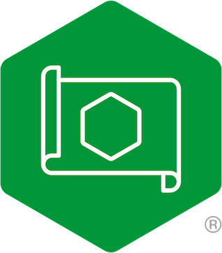

# Modern Container Application Reference Architectures

## Current Test Status

  

This repository has the basics for a common way to deploy and manage modern
apps. Over time, we'll build more example architectures using different
deployment models and options – including other clouds – and you’ll be able
to find those here.

## Nomenclature

Internally, we refer to this project as MARA for Modern Application Reference
Architecture. The current repository name reflects the humble origins of this
project, as it was started with the purpose of allowing users to build custom
versions of the NGINX Ingress Controller in Kubernetes. This went so well that
we expanded it to the project you're currently viewing.

## Modern App Architectures

We define modern app architectures as those driven by four characteristics:
*scalability*, *portability*, *resiliency*, and *agility*. While many different
aspects of a modern architecture exist, these are fundamental.

* **Scalability** – Quickly and seamlessly scale up or down to accommodate
  spikes or reductions in demand, anywhere in the world.

* **Portability** – Easy to deploy on multiple types of devices and
  infrastructures, on public clouds, and on premises.

* **Resiliency** – Can fail over to newly spun‑up clusters or virtual
  environments in different availability regions, clouds, or data centers.

* **Agility** – Ability to update through automated CI/CD pipelines with higher
  code velocity and more frequent code pushes.

This diagram is an example of what we mean by a **modern app architecture**:

To satisfy the four key characteristics, many modern app architectures employ:

* Platform agnosticism
* Prioritization of OSS
* Everything defined by code
* CI/CD automation
* Security-minded development
* Containerized builds
* Distributed storage

## What's Being Built

For details on the current state of this project, please see the
[readme](pulumi/python/README.md) in the [`pulumi/python`](pulumi/python)
subdirectory. This project is under active development, and the current work is
using [Pulumi](https://www.pulumi.com/) with Python. Additionally, please see
[Status and Issues](docs/status-and-issues.md) for the project's up-to-date
build status and known issues.

Subdirectories contained within the root directory separate reference
architectures by infrastructure deployment tooling with additional
subdirectories as needed. For example, Pulumi allows the use of multiple
languages for deployment. As we decided to use Python in our first build, there
is a `python` subdirectory under the `pulumi` directory.

This project was started to provide a complete, stealable, easy to deploy, and
standalone example of how a modern app architecture can be built. It was driven
by the necessity to be flexible and not require a long list of dependencies to
get started. It needs to provide examples of tooling used to build this sort of
architecture in the real world. Most importantly, it needs to work. Hopefully
this provides a ‘jumping off’ point for someone to build their own
infrastructure.

## Tools Chains

1. Pipeline: Github ci
2. IAC Tool: Pulumi
3. CodeRepo: Github 
4. Registry: Harbor
5. Monitor：
  - logs: Loki
  - tracing: Deepflow
  - mectic: Prometheus
  - notify: Alertmanger
  - datastore: Clickhouse
  - visualization：Grafana
6. cluster management: 
  - k3s
  - k8s
7. Ingress: nginx
8. DNS

## Contribution

## License

